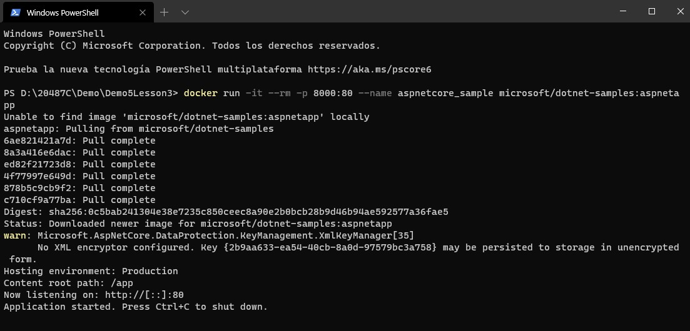
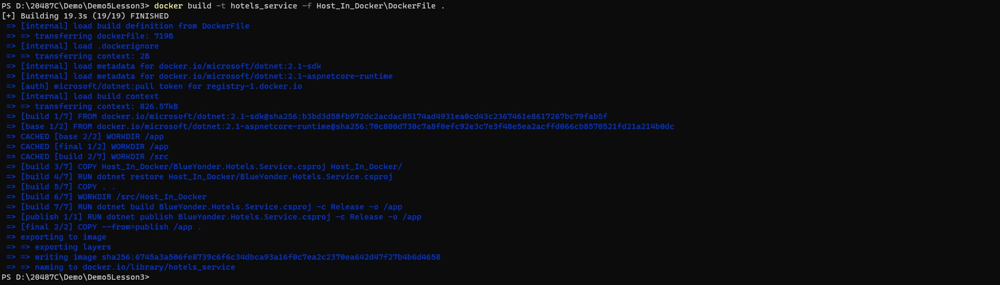
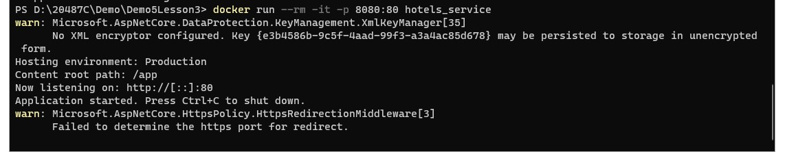
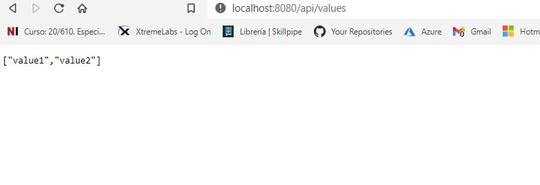
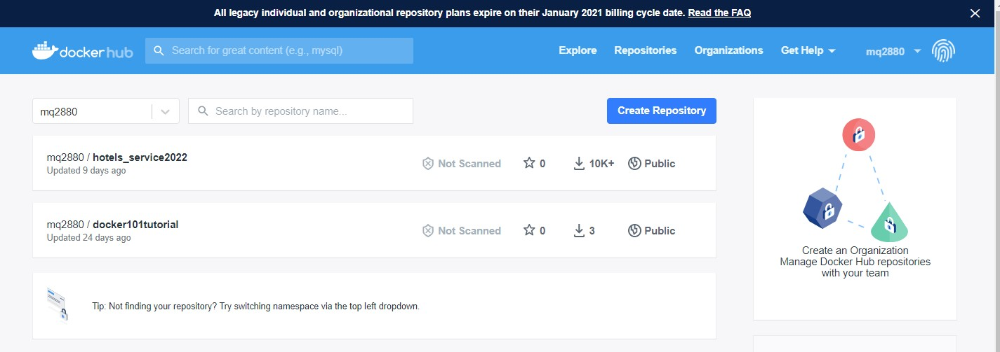
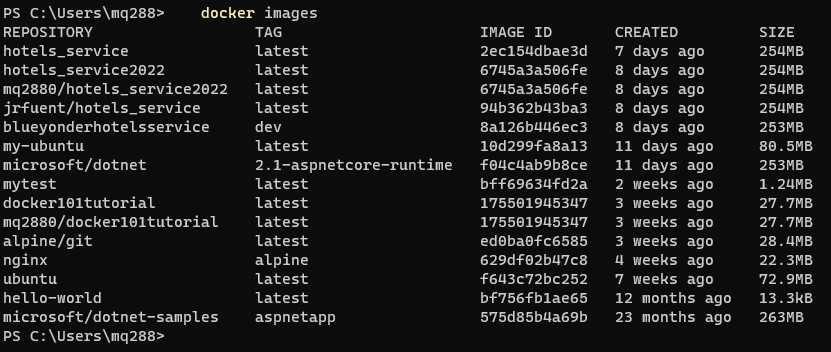
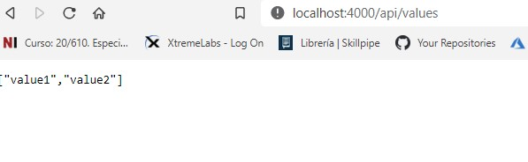

# Module 5: Hosting Services On-Premises and in Azure

# Lesson 3: Packaging Services in Containers

### Demonstration: Publishing into a Container

- Lanzamos un **ASP.NET Core** container tque escuche en el puerto 8080 

  ```bash
  docker run -it --rm -p 8000:80 --name aspnetcore_sample microsoft/dotnet-samples:aspnetapp
  ```



- Creamos una nueva Web App BlueYonder.Hotels.Service 
- Creamos el **DockerFile** 


```
    FROM microsoft/dotnet:2.1-aspnetcore-runtime AS base
    WORKDIR /app

    EXPOSE 55419
    EXPOSE 44398

    FROM microsoft/dotnet:2.1-sdk AS build
    WORKDIR /src
    COPY Host_In_Docker/BlueYonder.Hotels.Service.csproj Host_In_Docker/
    RUN dotnet restore Host_In_Docker/BlueYonder.Hotels.Service.csproj
    COPY . .
    WORKDIR /src/Host_In_Docker
    RUN dotnet build BlueYonder.Hotels.Service.csproj -c Release -o /app

    FROM build AS publish
    RUN dotnet publish BlueYonder.Hotels.Service.csproj -c Release -o /app

    FROM base AS final
    WORKDIR /app
    COPY --from=publish /app .
    ENTRYPOINT ["dotnet", "BlueYonder.Hotels.Service.dll"]
```

- Construimos el Container

  ```bash
      docker build -t hotels_service -f Host_In_Docker\DockerFile .
  ```

  

- Corremos el container

  ```bash
      docker run --rm -it -p 8080:80 hotels_service
  ```

  

  

- Comprobamos **localhost:8080/api/values**.

  
  
  

  
  
- Nos logamos en Docker Hub 

  ```bash
      docker login
      
  ```

- Creamos un tag para imagen del Docker Hub

  ```bash
      docker tag hotels_service mq2880/hotels_service2022
  ```

- Subimos la imagen

  ```bash
      docker push mq2880/hotels_service2022
  ```

  

  

- Para traer la imagen del Docker Hub

  ```bash
      docker pull mq2880/hotels_service2022
  ```

- Para ver tus imagenes locales y remotas

  ```bash
      docker images
  ```

  


- Ejecutamos la imagen en el equipo

  ```bash
      docker run -p 4000:80 mq2880/hotels_service2022       
  ```

- comporbamos **localhost:4000/api/values**.

  

  
